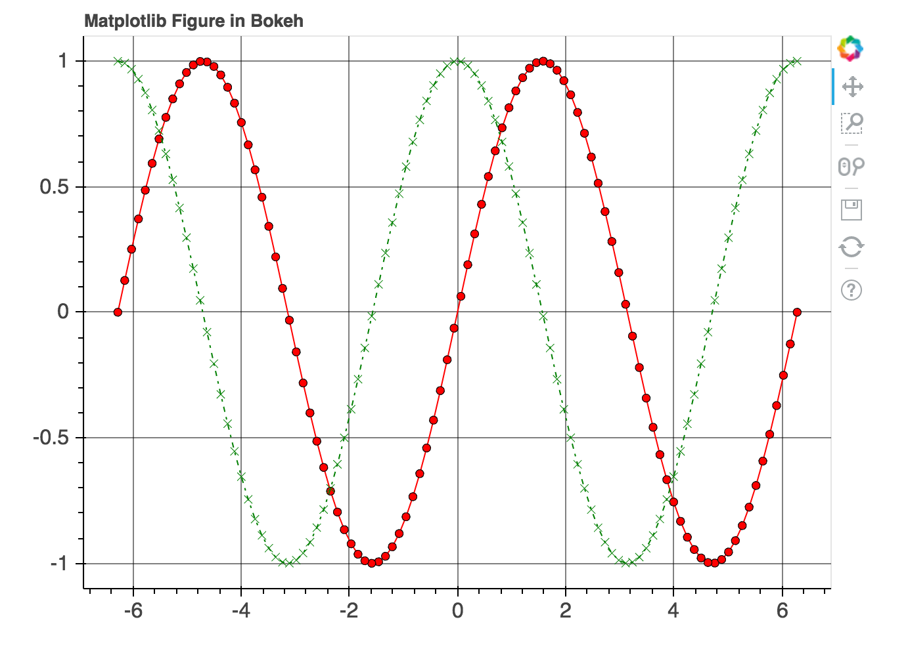

#  (Optional) Morning Exercise: Troubleshooting + Reading Documentation
Week 13 | Exercise 2.0


## Learning new tools from the documentation: conceptual steps

- What does the thing do?
    - Read summary
    - See examples
- Which methods do I need?
    - What do they take as inputs, and what do they return?
- What's a minimal example I can get working?
    - Create fake, minimal inputs.

## Challenge 1

Try getting your hands on a new package: install `Bokeh` and reproduce this example or something similar:



Hint: this is a direct conversion of a matplotlib figure into Bokeh. The underlying data are:

```python
x = np.linspace(-2 * np.pi, 2 * np.pi, 100)
y = np.sin(x)
z = np.cos(x)
```
